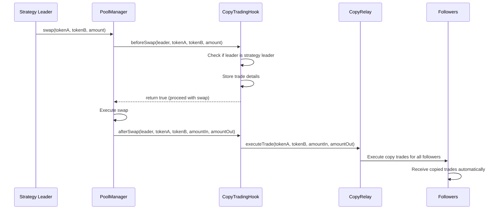

# Uniswap Integration in PookieFI

## Overview

PookieFI is a Social DeFi platform that integrates with **Uniswap v4** to enable copy trading functionality. This document explains how we're using Uniswap v4's innovative hook system to create an automated copy trading experience.

## Table of Contents

1. [Uniswap v4 Integration Architecture](#uniswap-v4-integration-architecture)
2. [Package Dependencies](#package-dependencies)
3. [Hook System Implementation](#hook-system-implementation)
4. [Pool Management](#pool-management)
5. [Copy Trading Flow](#copy-trading-flow)
6. [Configuration & Deployment](#configuration--deployment)
7. [Frontend Integration](#frontend-integration)
8. [Development Phases](#development-phases)

## Uniswap v4 Integration Architecture

### Why Uniswap v4?

We chose Uniswap v4 over v3 because of its revolutionary **hook system** that allows us to:

- **Intercept swaps** before and after they happen
- **Automatically trigger copy trades** when strategy leaders trade
- **Attach custom logic** to the swap lifecycle
- **Create permissionless copy trading** without manual intervention

### Core Components

```
┌─────────────────┐    ┌──────────────────┐    ┌─────────────────┐
│   Strategy      │    │   Uniswap v4     │    │   Copy Trading  │
│   Leaders       │───▶│   PoolManager    │───▶│   Hook          │
│   (Traders)     │    │   + Hooks        │    │   (Our Logic)   │
└─────────────────┘    └──────────────────┘    └─────────────────┘
                                                         │
                                                         ▼
                                               ┌─────────────────┐
                                               │   Followers     │
                                               │   (Auto Copy)   │
                                               └─────────────────┘
```

## Package Dependencies

### What We're Using

```json
{
  "dependencies": {
    "@uniswap/v4-core": "^1.0.2",
    "@uniswap/v4-periphery": "^1.0.3"
  }
}
```

### What We're NOT Using

- ❌ `@uniswap/core` (this is for v2/v3)
- ❌ `@uniswap/v3-sdk` (this is for v3)
- ❌ `@uniswap/v2-sdk` (this is for v2)

### Why These Packages?

- **`@uniswap/v4-core`**: Contains the core v4 interfaces, types, and libraries
- **`@uniswap/v4-periphery`**: Contains the BaseHook contract and periphery utilities

## Hook System Implementation

### Current Implementation (Phase 3)

We have two hook implementations:

#### 1. Conceptual Hook (`CopyTradingHookV4.sol`)
```solidity
contract CopyTradingHookV4 {
    address public immutable poolManager;
    CopyRelay public immutable copyRelay;
    
    // Hook functions
    function beforeSwap(...) external onlyPoolManager returns (bool) {
        // Detect if trader is a strategy leader
        // Store trade details for afterSwap
    }
    
    function afterSwap(...) external onlyPoolManager {
        // Execute copy trades for all followers
        // Trigger CopyRelay.executeTrade()
    }
}
```

#### 2. Real v4 Hook (`future-contracts/CopyTradingHook.sol`)
```solidity
import {BaseHook} from "v4-periphery/BaseHook.sol";
import {IPoolManager} from "v4-core/interfaces/IPoolManager.sol";
import {Hooks} from "v4-core/libraries/Hooks.sol";

contract CopyTradingHook is BaseHook {
    function getHookPermissions() public pure override returns (Hooks.Permissions memory) {
        return Hooks.Permissions({
            beforeSwap: true,  // Detect leader trades
            afterSwap: true,   // Execute copy trades
            // All other permissions: false
        });
    }
}
```

### Hook Permissions

Our hook uses these specific v4 permissions:

| Permission | Value | Purpose |
|------------|-------|---------|
| `beforeSwap` | ✅ true | Detect when strategy leaders are about to trade |
| `afterSwap` | ✅ true | Execute copy trades after leader swaps complete |
| `beforeInitialize` | ❌ false | Not needed |
| `afterInitialize` | ❌ false | Not needed |
| `beforeAddLiquidity` | ❌ false | Not needed |
| `afterAddLiquidity` | ❌ false | Not needed |
| `beforeRemoveLiquidity` | ❌ false | Not needed |
| `afterRemoveLiquidity` | ❌ false | Not needed |
| `beforeDonate` | ❌ false | Not needed |
| `afterDonate` | ❌ false | Not needed |

## Pool Management

### Supported Networks

We support Uniswap v4 on multiple networks:

#### Mainnet Networks
- **Ethereum**: `0x000000000004444c5dc75cB358380D2e3dE08A90`
- **Polygon**: `0x67366782805870060151383f4bbff9dab53e5cd6`
- **Base**: `0x498581ff718922c3f8e6a244956af099b2652b2b`
- **Arbitrum**: `0x360e68faccca8c495c1b759fd9eee466db9fb32`
- **Optimism**: `0x9a13f98cb987694c9f086b1f5eb990eea8264ec3`

#### Testnet Networks
- **Sepolia**: `0xE03A1074c86CFeDd5C142C4F04F1a1536e203543`
- **Base Sepolia**: `0x05E73354cFDd6745C338b50BcFDfA3Aa6fA03408`
- **Arbitrum Sepolia**: `0xFB3e0C6F74eB1a21CC1Da29aeC80D2Dfe6C9a317`

### Pool Creation Process

1. **Deploy Hook Contract** with PoolManager address
2. **Create Pool** with hook attached using special address encoding
3. **Register Pool** in our CopyRelay for copy trading
4. **Enable Copy Trading** for the specific pool

### Configuration File

Our configuration is stored in `copytrade/config/uniswap-v4-addresses.json`:

```json
{
  "mainnet": {
    "polygon": {
      "chainId": 137,
      "PoolManager": "0x67366782805870060151383f4bbff9dab53e5cd6",
      "PositionManager": "0x1ec2ebf4f37e7363fdfe3551602425af0b3ceef9",
      "Quoter": "0xb3d5c3dfc3a7aebff71895a7191796bffc2c81b9",
      "StateView": "0x5ea1bd7974c8a611cbab0bdcafcb1d9cc9b3ba5a",
      "UniversalRouter": "0x1095692a6237d83c6a72f3f5efedb9a670c49223"
    }
  }
}
```

## Copy Trading Flow

### How It Works

1. **Strategy Leader** creates a strategy and becomes a leader
2. **Followers** subscribe to the leader's strategy
3. **Pool Creation** happens with our copy trading hook attached
4. **Leader Trades** on the Uniswap v4 pool
5. **Hook Intercepts** the trade through `beforeSwap()` and `afterSwap()`
6. **Copy Trading** automatically executes for all followers
7. **Fees** are collected according to strategy settings

### Detailed Flow



### Event System

Our hook emits these events:

```solidity
event LeaderTradeDetected(
    address indexed leader,
    address indexed tokenIn,
    address indexed tokenOut,
    uint256 amountIn,
    uint256 amountOut
);

event CopyTradeExecuted(
    address indexed leader,
    address indexed follower,
    uint256 amountIn,
    uint256 amountOut
);
```

## Configuration & Deployment

### Deployment Scripts

We have multiple deployment scripts for different phases:

1. **`deploy-phase3-v4.js`** - Deploy v4 hook integration
2. **`deploy-v4-real.js`** - Deploy with real v4 addresses
3. **`deploy-v4-integration.js`** - Full v4 integration

### Example Deployment

```javascript
// Load v4 addresses
const v4Addresses = JSON.parse(
  fs.readFileSync(path.join(__dirname, "../config/uniswap-v4-addresses.json"), "utf8")
);

// Deploy hook with real PoolManager
const hook = await CopyTradingHookV4.deploy(
  v4Addresses.mainnet.polygon.PoolManager,
  copyRelayAddress
);
```

### Pool Creation Example

```javascript
// Create pool with hook attached
const poolKey = {
  currency0: tokenA,
  currency1: tokenB,
  fee: 3000,
  tickSpacing: 60,
  hooks: hookAddress // Our copy trading hook
};

await poolManager.initialize(poolKey, sqrtPriceX96);
```

## Frontend Integration

### V4PoolInterface Component

Our React component (`src/components/V4PoolInterface.tsx`) provides:

- **Pool Selection** - Choose which v4 pool to trade on
- **Trade Execution** - Execute swaps that trigger copy trading
- **Leader Verification** - Ensure only strategy leaders can trade
- **Real-time Updates** - Show copy trading activity

### Key Features

```typescript
interface PoolInfo {
  id: string;
  tokenA: string;
  tokenB: string;
  symbolA: string;
  symbolB: string;
  copyTradingEnabled: boolean;
  totalLiquidity: string;
  volume24h: string;
}
```

### Trade Execution

```typescript
const executeV4Trade = async () => {
  // 1. Verify user is strategy leader
  if (!isLeader) {
    alert('You must be a strategy leader to use v4 copy trading!');
    return;
  }
  
  // 2. Execute trade through PoolManager
  // 3. Hook automatically detects and triggers copy trading
  // 4. All followers receive copied trades
};
```

## Development Phases

### Phase 1-2: Foundation ✅
- Basic copy trading with manual execution
- Strategy NFT system
- Subscription management
- Test token implementation

### Phase 3: Uniswap v4 Integration 🚧
- Real v4 hook implementation
- Pool creation with hooks
- Automatic copy trading
- Multi-network support

### Phase 4: Advanced Features (Planned)
- 1inch limit order integration
- Dynamic fee management
- Advanced hook permissions
- Cross-chain copy trading

### Phase 5: AI Integration (Planned)
- AI-powered strategy recommendations
- Automated risk management
- Performance analytics
- Smart copy trading algorithms

## Key Benefits of Our Uniswap v4 Integration

### 1. **Automatic Copy Trading**
- No manual intervention required
- Trades happen instantly when leaders trade
- Seamless user experience

### 2. **Permissionless System**
- Anyone can create strategies
- Anyone can follow strategies
- No centralized control

### 3. **Gas Efficient**
- Uses v4's singleton design
- Flash accounting optimizations
- Reduced transaction costs

### 4. **Flexible Hook System**
- Custom logic for copy trading
- Easy to extend and modify
- Future-proof architecture

### 5. **Multi-Network Support**
- Works across all v4 networks
- Consistent experience everywhere
- Easy network switching

## Security Considerations

### Hook Security
- Only PoolManager can call hook functions
- Reentrancy protection
- Input validation
- Error handling

### Copy Trading Security
- Leader verification
- Amount validation
- Slippage protection
- Fee management

## Future Enhancements

### Planned Features
1. **Dynamic Fees** - Adjust copy trading fees based on performance
2. **Risk Management** - Stop-loss and take-profit automation
3. **Cross-Chain** - Copy trading across different networks
4. **AI Integration** - Smart strategy recommendations
5. **Advanced Analytics** - Performance tracking and insights

## Conclusion

Our Uniswap v4 integration represents a cutting-edge approach to copy trading in DeFi. By leveraging v4's hook system, we've created a permissionless, automated, and efficient copy trading platform that works seamlessly across multiple networks.

The hook-based architecture allows us to intercept trades at the protocol level, ensuring that copy trading happens automatically and reliably without requiring users to manually execute trades or monitor leader activity.

This integration positions PookieFI as a leader in the Social DeFi space, providing users with a powerful and intuitive way to follow and copy successful trading strategies on Uniswap v4.